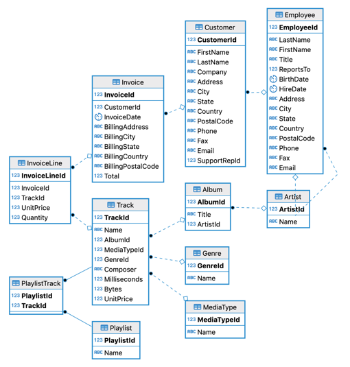

# Abstract
As large language models (LLMs) become ever more capable of assisting humans with everyday tasks, their use for helping people understand data is an intriguing prospect. While this project is not the first to explore the use of LLMs for database interfacing, it aims to provide a unique approach to evaluating systems in this area and to explore possible approaches for improving LLM database interfaces. 

# 1 - Problem Statement
Information and access to it are an increasingly import part of the modern world. Products and systems do exist to help users find this information as easily as possible, but sometimes users require niche combinations of data that developers did not anticipate. To that end, the goal of this project is to develop a system by which users may ask questions in natural language (English), and also receive an answer in natural language, based on data contained within the related database.

# 2 - Existing Research and Products
This project is not the first to look into the problem of integrating natural language processing with databases. There are a variety of existing products and research that have been done in this area, and this section aims to provide a brief overview of some of these products and research. More generally, this problem is popularly called "text-to-SQL" in the language model and machine learning space.

## 2.1 - LLMs
Simple language model inferences by themselves have proven somewhat useful in solving the text-to-SQL problem when they are sufficiently large or well tuned to the problem. In a general sense, large models like OpenAI's GPT-3 and GPT-4 models tend to perform fairly well, so long as prompts are crafted to make the problem more clear. See the [results](#34---results) section for more information on how these models performed on the Chinook database using Langchain's sql_database agent. Though not tested in this project, organizations such as [BigCode](https://www.bigcode-project.org/) and [Defog AI](https://defog-ai.github.io/) have also had success with fine tuning language models to handle similar problems. In particular, BigCode's [StarCoder](https://huggingface.co/bigcode/starcoder) model is trained on the text-to-code problem, and Defog AI's [SQLCoder](https://huggingface.co/defog/sqlcoder) model is trained more specifically on the text-to-SQL problem. Defog claims that their model performs better than GPT-3 when generating SQL queries, and almost as well as GPT-4.

## 2.2 - Complex Text-to-SQL Systems
Beyond simple language model inferencing, much work has been done on more cohesive systems that aim to further improve performance of natural language processing for the text-to-SQL problem. One such system is [Langchain's SQL Database agent](https://python.langchain.com/docs/integrations/toolkits/sql_database). This system uses a combination of language models for both writing SQL queries themselves, and reasoning about how to get the information it needs, plus supporting tools for output parsing and query execution. The primary advantage of a more complex system such as this is that it can 1) more easily retrieve the portions of the database schema it needs without requiring the language model context window to be too large, 2) iterate over the queries it writes with new context on errors if the query fails, and 3) more easily parse the language model output and synthesize a human-readable answer to the original question.

Other similar systems exist, though Langchain's was the only one tested in this project. For example, [OpenAI's Assistants](https://platform.openai.com/assistants) feature can be built to accomplish a similar task exclusively on cloud resources. The nature of cloud computing can make it easier to iterate and develop quickly, though may hamper performance and cost more in the long run.

## 2.3 - Evaluation
Evaluation of generated SQL queries and their corresponding natural language answers is one of the most difficult problems plaguing the development of solutions to the text-to-SQL problem. Since initial questions can contain ambiguity and even solutions to any particular question may not be exclusive, it is incredibly difficult to determine of a generated query is correct or not. Prior research has been done to help combat this problem. Defog AI developed their own [evaluation framework](https://github.com/defog-ai/sql-eval) using the popular Spider dataset. Their approach is to generate queries with a language model, and compare the generated query against a ground-truth solution using exact and subset matching on the result sets from executing each query. Another example of an evaluation framework is [WikiSQL](https://github.com/salesforce/WikiSQL), developed by Salesforce, which has similar goals of trying to evaluate queries against a ground-truth solution.

# 3 - Current Project
The current project aims to evaluate the performance of existing techniques in the text-to-SQL category of language models, primarily looking at Langchain's existing sql_database agent, and OpenAI's GPT-3.5 and GPT-4 models. The goal is to determine if these models are capable of answering questions about a database, and if so, how well they perform. Presuming this basic system would not be sufficient for a production use case of text-to-SQL models, the project also aims to identify areas of improvement for the system, and propose possible solutions to these problems.

## 3.1 - Data
This project uses the famous Chinook database for testing and evaluation. You can find scripts for recreating this database in a variety of SQL implementations in [this Github repository](https://github.com/lerocha/chinook-database).

As a general overview, the Chinook database contains information about a fictional digital music store. It contains information about artists, albums, tracks, invoices, customers, and employees.



*ER diagram courtesy of [Kaggle](https://www.kaggle.com/datasets/nancyalaswad90/chinook-sample-database)*

On this particular dataset, a sample question may look like "How many customers have made repeat purchases?", and to answer this question, a typical programmer might write a query that looks something like this:
```sql
SELECT COUNT(*) FROM (
    SELECT COUNT(*) FROM Invoice
    GROUP BY CustomerId
    HAVING COUNT(*) > 1
) AS CustomerCount;
```

## 3.2 - System Overview
For this project, a variety of language models were tested using Langchain's SQL database agent. In all cases, the same language model was used for both the reasoning engine and the query generation portions of the agent. OpenAI's Divinci, GPT-3.5-turbo, GPT-4, and GPT-4-turbo models were tested (see below for the results of these tests). Per the design of Langchain's SQL agent, the reasoning engine was used to determine which tables to retrieve schema information for, when to ask the query generator to write a query, execute the returned query, and formulate natural language responses.


### 3.2.1
First in the chain, the user inputs a question in natural language, ideally related to the data stored in the database. The intent of a text-to-SQL system like this is that the user shouldn't require technical knowledge on either the database schema, or SQL itself.

### 3.2.2 - 3.2.3
Once the reasoning agent has received the question, it has a myriad of tools at its disposal for processing that question. Generally, the first step it will take is to formulate a command to the database about what tables exist in the database. Upon retrieving the information, it can filter out the list to formulate an additional command with a set of tables it needs to retrieve detailed schema information for. The reasoning agent itself is an LLM, so it handles this step internally. Upon receiving schema information on the specified tables from the database, the reasoning agent will typically pass the relevant schema information and the original question to the query generator.

### 3.2.4 - 3.2.7
Given the schema information from the reasoning agent, the query generator can write an initial SQL query to retrieve the necessary information for answering the user's initial question. Once this query is written, it can attempt to run this query against the database (5), and the database will return either the result of the query or an error (6). If the query fails, the query generator can attempt to rewrite the query with additional context from the error message and send the updated query back to the database. This process can repeat until the query succeeds or the query generator runs out of attempts. Once the query succeeds, the query generator can pass the result set back to the reasoning agent (7).

### 3.2.8
After receiving the result set from the query generator, the reasoning agent can use the data to formulate a natural language response to the original question. This response can then be returned to the user.

## 3.3 - System Evaluation
For this project, it was decided to develop a new evaluation framework, primarily due to the complexity of other available frameworks. In addition, a major goal of this new framework was to evaluate an entire system, rather than only the generated SQL query. To that end, the evaluation framework developed for this project (found in the evaluation directory), aims to accomplish this by using a separate language model inference to compare the natural language solution from a system like Langchain's agent to a ground-truth natural language answer. Some examples of this comparison can be see in the [example evaluations](#342---example-evaluations) section below. To make this comparison, questions were first answered by a human to act as a ground-truth answer. Examples of these human answers can be found in the [questions](#331---questions) section below, and the full list can be found in [questions.md](./evaluation/llms/questions.md) along with the questions themselves. Then, to evaluate a language model, the natural language answers to questions were compared to the human answers using a separate language model inference tasked solely with determining if the two answers were similar. More on the evaluator task can be found in the [Evaluator LLM](#3.3.2---evaluator-llm) section below.

A major reason an approach like this was chosen for this project is that other evaluation techniques become complex very quickly due to the need to evaluate questions that have answers with a variety of formats. For example, some questions such as "What is the average price of a track in the database?" can be answered with a simple numerical value, but questions like "What is the distribution of music genres in the Chinook database?" require a more language-oriented answer. Questions like the later are also complex due to ambiguity, so comparing directly to the human answer doesn't make much sense.

### 3.3.1 - Questions
To evaluate the models and systems, 32 questions were proposed and human-labeled with difficulty rankings and answers. Four categories of complexity were evaluated: basic (likely no join statements required), simple (likely only one or two simple joins), complex (complex joins and/or sub-queries), and invalid questions that don't make sense or can't be answered on the data.
A sample of the dataset is as follows, and the full dataset can be found in the [questions.md](./evaluation/llms/questions.md) file.
| Question Text | Complexity | Human Answer |
| ------------- | ---------- | ------------ |
| What is the average price of a track in the database? | Basic | The average track price is $1.05. |
| What is the distribution of music genres in the Chinook database? | Basic | There are 25 genres in the database. A few examples are Rock, Metal, Blues, and Drama. |
| What are the preferred languages for track titles in the database? | Simple | All the tracks are in English. |
| How many customers have made repeat purchases? | Simple | There are 59 customers who have made repeat purchases. |
| Can you identify any customers who have made purchases in multiple countries? | Complex | There aren't any customers that have made purchases in multiple countries. |
| What is the total revenue generated by each employee? | Complex | Jane Peacock generated $833.04, Margaret Park generated $775.40, Steve Johnson generated $720.16, and the remainder of the employees generated no revenue. |
| Which tracks have been played the most based on play count data? | Invalid | The database does not contain play count data. |
| What is the most common method of payment used by customers? | Invalid | The database does not contain payment method data. |

### 3.3.2 - Evaluator LLM
When developing the evaluation framework, two language models were tested as the evaluator model, both attempting to evaluate answers generated by OpenAI's Divinci model against the human answers. 

Both the Divinci version and GPT-3.5-Turbo versions of the evaluator were tested on the full 32 question dataset. The full set of questions can be found in the [questions.md](./evaluation/llms/questions.md) file. Each version of the model was tasked to determine if the LLM generated answer and human answer were similar or not, given the prompt: `Answer only yes or now, with no explanation or punctuation.\nDo the following two statements convey the same meaning?\n{human_answer}\n{llm_answer}.`

To determine the effectiveness of each version of the evaluator, the same comparison was done by a human, keeping track of how many questions the automatic evaluator correctly classified, incorrectly said were not similar, and incorrectly said were similar.

To see the full results tested results of each evaluator, see the [divinci_evaluator.md](./evaluation/divinci_evaluator.md) and [gpt_3_evaluator.md](./evaluation/gpt_3_evaluator.md) files.

Note that in both versions of the evaluator, two questions were ignored and later corrected due to inaccuracies in the human answers. These two questions are not counted in the below statistics.

| Evaluator Version  | False positives | False negatives |Accuracy (% correctly classified) |
| ------------------ | -------------------- | -------------------- | -------------------------------- |
| Divinci            | 1 (3%)               | 8 (26%)              | 71%                              |
| GPT-3.5-Turbo      | 4 (13%)              | 1 (3%)               | 77%                              |

*In the above table, false positives refer to questions that the evaluator marked as similar, but the human classified as not similar. In contrast, false negatives refer to questions that the evaluator marked as not similar, but the human classified as similar.*

It is important to note that these accuracy values of the evaluator itself are too low to comfortably say much about how good an individual generator LLM is on the text-to-SQL task, but they are consistent enough to *compare* models against each other or over time on the same dataset. Of course, human evaluation would be significantly more accurate, but over a large dataset and a large number of potential models, human evaluation is generally not feasible. The evaluator itself could be improved with further prompt engineering or other techniques, but that is outside the scope of this project.

## 3.4 - Results

### 3.4.1 - Model Accuracy
<!-- Accuracy is based on 32 question dataset -->
<table>
    <tr>
        <th rowspan=2 style="text-align: center;">Model</th>
        <th colspan=5 style="text-align: center;">Accuracy (% classified as correct by automated evaluator)</th>
    </tr>
    <tr>
        <th style="text-align: center;">Basic</th>
        <th style="text-align: center;">Simple</th>
        <th style="text-align: center;">Complex</th>
        <th style="text-align: center;">Invalid</th>
        <th style="text-align: center;">Total</th>
    </tr>
    <tr>
        <td>OpenAI Divinci</td>
        <td>100.0% (7/7)</td>
        <td>40.0% (4/10)</td>
        <td>50.0% (5/10)</td>
        <td>00.0% (0/5)</td>
        <td>59.4% (19/32)</td>
    </tr>
    <tr>
        <td>OpenAI GPT-3.5 Turbo</td>
        <td>71.4% (5/7)</td>
        <td>60.0% (6/10)</td>
        <td>90.0% (9/10)</td>
        <td>00.0% (0/5)</td>
        <td>62.5% (20/32)</td>
    </tr>
    <tr>
        <td>OpenAI GPT-4</td>
        <td>71.4% (5/7)</td>
        <td>70.0% (7/10)</td>
        <td>70.0% (7/10)</td>
        <td>20.0% (1/5)</td>
        <td>62.5% (20/32)</td>
    </tr>
    <tr>
        <td>OpenAI GPT-4 Turbo</td>
        <td>85.7% (6/7)</td>
        <td>90.0% (9/10)</td>
        <td>70.0% (7/10)</td>
        <td>00.0% (0/5)</td>
        <td>68.8% (22/32)</td>
    </tr>
</table>

*Note: The accuracy values are based on the evaluator. See above for a discussion on the accuracy of the evaluator itself.*

### 3.4.2 - Example Evaluations
| LLM            | Question Text                                         | Similarity                                                              | LLM Answer | Human Answer |
| -------------- | ----------------------------------------------------- | ----------------------------------------------------------------------- | ------------ | ------------------------------------------------ |
| Divinci Agent | What is the average price of a track in the database? | Similar | The average price of a track in the database is $1.05. | The average track price is $1.05 |
| Divinci Agent | How many customers have made repeat purchases? | Not Similar | There are 57 customers who have made repeat purchases. | There are 59 customers that have made repeat purchases |
| GPT-3.5 Agent | Can you identify the most and least expensive tracks? | Similar | The most expensive track is "Battlestar Galactica: The Story So Far" with a unit price of $1.99. The least expensive track is "For Those About To Rock (We Salute You)" with a unit price of $0.99. | The most expensive tracks cost $1.99, and the least expensive tracks cost $0.99. |
| GPT-3.5 Agent | What are the preferred languages for track titles in the database? | Not Similar | Based on the schema of the "Track" table, there is no specific column that indicates the preferred language for track titles. | All the tracks are in English. |

# 4 - Next Steps
While Langchain's SQL Agent does a relatively good job of answering questions in this manner, even the 68% accuracy of the GPT-4-turbo model is not sufficient for a production system. There are a variety of methods that could improve the system, and this section aims to outline some of those possibilities. In no particular order of importance, some of these options include further prompt engineering, fine tuning the language models, and adding additional tools or steps to the pipeline. Specifically adding additional processes for reducing ambiguity and introducing post-processing techniques for validity and consistency may help a system such as this be more production-ready.

## 4.1 -  Prompt Engineering
Prompt engineering is possibly the most obvious approach to improving a text-to-SQL system like this. While significant engineering was put into Langchain's included SQL agent, further refining their choices of prompts to fit the particular combination of reasoning engine and query generator language models may improve performance. In addition, specifying prompts more specifically for the domain of the problem, or even the specific database schema may help the language models better interpret the questions that are being asked, and therefore produce better and more reliable answers. This option has the other major advantage of costing nothing in terms of training models or introducing additional computational steps, and therefore is likely the most cost-effective option. Because of this, prompt engineering is likely the first step that should be taken to improve a system like this.
 
## 4.2 - Fine Tuning
Fine tuning is likely one of the most effective ways to improve a system like this. Tuning would allow the SQL generation model to become more proficient at that particular task as compared to a more general-purpose model like the ones by OpenAI. According to OpenAI, fine tuning a GPT model shouldn't take more than a few dozen examples, and isn't prohibitively expensive considering that the model would only need to be tuned once and then used like any other model. In general, this method requires more sample data than prompt engineering or other techniques, and therefore should only really be used if other techniques are not sufficient.

## 4.3 - Additional Tools/Steps
Beyond prompt engineering and fine tuning, there are a variety of other systems that could be integrated into a text-to-SQL system to improve performance. Among other things, these systems could include additional systems for reducing ambiguity and post-processing steps to help ensure validity of generated solutions.

### 4.3.1 - Reducing Ambiguity
Ambiguity in asked questions is a major issue for text-to-SQL systems. Users cannot be relied upon to ask questions in a way that is unambiguous and easy for a language model to interpret.

One possibility for combatting this problem is to pass the users' questions through a separate language model tasked with identifying ambiguity and rewriting a question to be less ambiguous. Some work on prompt engineering would have to be done to produce a subsystem that is effective at this task. To produce a system like this, the model could first be asked to identify if a question is ambiguous or not. If the question is not ambiguous, the question could be passed through to the reasoning engine and query generator as normal. If the question is ambiguous, the question could be passed through to a second language model tasked with rewriting the question to be less ambiguous. This rewritten question could then be passed through the reasoning engine and query generator as normal. Once rewritten, the rewritten question could be displayed to the user along with a warning that the question was rewritten or interpreted in the specified way. 

### 4.3.2 - Post Processing
Although not explored in this project, it is possible that post-processing steps could be added to the system to help ensure validity of the generated answers. For example, a post-processing step could be added to check if the generated answer actually is similar to the original question that was being asked. Depending on the generator and reasoning models used, a step like this might not be useful or necessary, but it is a possibility that could be explored.

# 5 - Conclusion
This project aimed to evaluate the performance of existing techniques in the text-to-SQL category of language models, primarily looking at Langchain's existing sql_database agent, and OpenAI's GPT-3.5 and GPT-4 models. Relatively simple systems like these are capable of answering basic questions related to data in a database using text-to-SQL techniques with a reasonable degree of accuracy. However, these systems are not yet accurate or reliable enough for production use, and further work is required to improve their performance in these ways. Prompt engineering and fine tuning are likely the most effective ways to improve a system like this, and should be explored further. In addition, other techniques can be used to further augment systems for production use. To that end, the concept described in [section 4.3.1 - Reducing Ambiguity](#4.3.1---reducing-ambiguity) seems especially promising.